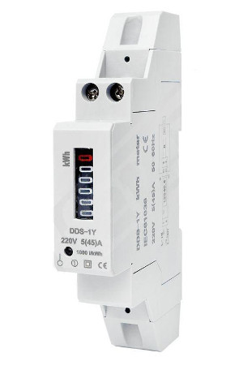

# An ESP32 based BLE beacon for energy meters with pulse output

An ESP32 based BLE beacon that counts pulses from an energy meter.

The program sends 8 bytes of data in BLE ManufacturerData about every 5 seconds. The data format is:

- 2 bytes of Manufacturer ID 0x02E5 (Espressif Inc)
- 2 bytes for identifying this sketch: 0xACDC (you know why :)
- 4 bytes of Wh total
- 4 bytes of Wh since last reset 
- 2 extra bytes as 0xBEEF because I could eat it every day

## Circuit

There are a lot of DIN rail installable energy meters that have a pulse output of 1000 impulses
per kWh or eg. 2000 impulses per kWh. Just connect your ESP32's GND to such meter's SO- and
GPIO13 to SO+

Install a reset button switch between GND and GPIO15

There are several defines in the beginning of the sketch, so eg. the pulse factor can be set.

## How it works

This program stores the total watt hours to ESP32's NVS every minute (configurable) if it has changed.
Theoretically once a minute saving should let the flash work at least 60 years before maximum write
cycles will be reached.

If the button is pressed more than 5 seconds, the board's LED will blink 5 times and then the program
saves the pulse count at the moment to the NVS. Just like resetting a trip meter in a car.

## An example picture of suitable energy meter

